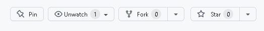

Contributions
=============

Une pull request, "PR", est la façon la plus simple de contribuer à ce dépot.

Je tiens pour acquis que tu as déjà un compte GitHub.

Installer Git
-----------------------------------------------
Etape indispensable, avant d'utiliser git, il va falloir l'installer.

Fort heuresement, c'est hyper simple. Il suffit de se rendre [sur le site officiel](https://git-scm.com/download/win).
Et suivre les instructions de l'installeur sans trop se poser de questions.

Pour s'assurer que git a bien été installé il suffit de demander sa version **dans une nouvelle** invite de commande.

    git version

Tant qu'on y est, autant configurer correctement git en lui fournissant quelques informations importantes.

    git config --global user.name "ecris_ici_ton_nom_et_prenom"
    git config --global user.email ecris_ici_ton_email

Fork
------------------------------
Récupère une copie de ce dépot en le forkant. Tu trouveras le bouton en haut à droite de cette page.

Félicitation. Tu es l'heureux propriétaire d'une copie parfaite de ce dépot dans tes dépots à toi.

Puisque c'est le tien, tu peux le cloner sur ton ordinateur personnel.

    git clone https://github.com/TON_PSEUDO_A_TOI/cours

Travail
---------------------------------
Je ne sais pas quelles sont tes habitudes de travail, mais je te recommande fortement de créer une nouvelle branche.

- Soit, tu as un super IDE et tu peux le faire avec une interface graphique.
- Soit, tu le fais en ligne de commande (et passer pour un giga chad auprès de tes potes)

    git checkout -b LE_NOM_DE_TA_BRANCHE

Fais tes modifications. Fais tout ce que tu as envie de faire, mais fais le bien.

Commits
---------------------------------
Ecris de beaux messages de commit. 

Je n'ai pas besoin d'une poésie mais, au minimum :
- La premiere ligne est le sujet. Elle commence par le cours sur lequel tu as effectué des modifications
- La seconde ligne reste vide
- Les lignes suivantes detaillent ce que tu as fait précisement.

Par exemple :
    
    [Docker] Correction orthographique
    
    Plusieurs fautes d'inattention.
    Nottament sur l'accord du participe passé

PR
---------------------------------
Lorsque tu seras satisfait du travail effectué, il sera temps de mettre à jour ton dépot.

    git push

Bien entendu, il serait dommage de ne pas proposer les modifications que tu as faites sur le dépot principal.

Si tout s'est passé correctement, tu verras apparaitre, sur ton dépot, un gros bouton vert te permettant de créer une _pull request_.

Une fois celle-ci soumise, sois patient. Je m'en occupe au plus vite.

Merci
---------------------------------