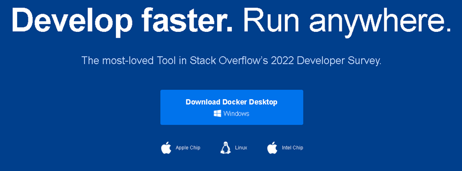
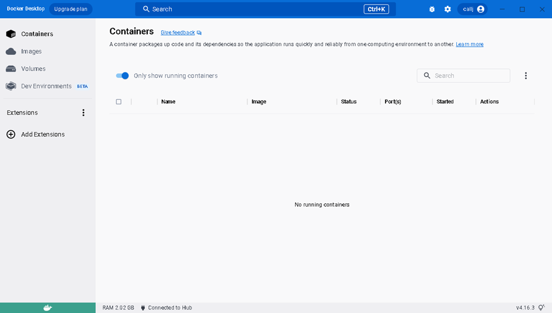
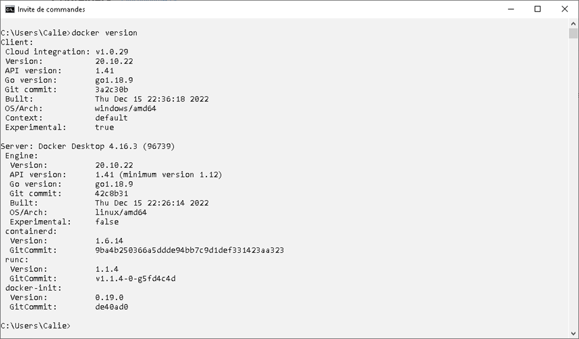
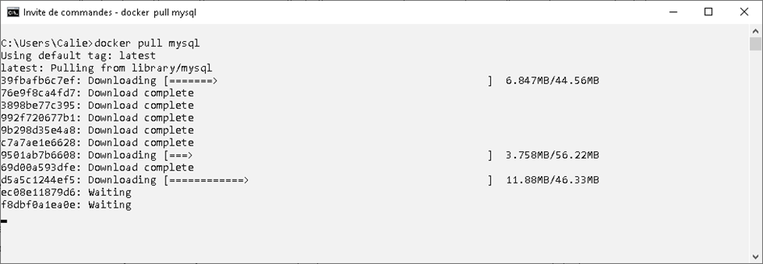
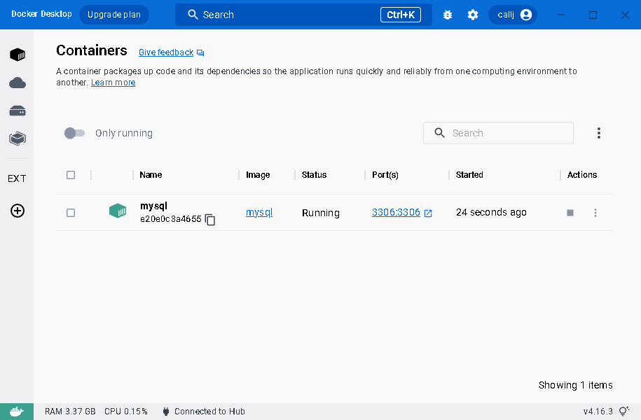

# Docker

## :speech_balloon: Définition

-------------

Docker est une plateforme logicielle de conteneurs.

Elle permet de compartimenter chaque élément de son application à l’intérieur « d’une boite » qui est auto suffisante et qui peut être facilement déployée et utilisée.
- Docker permet la création, le déploiement et le lancement d’une application dans un contexte complètement maitrisé et indépendant du système d’exploitation ou du type de la machine hôte.
- Docker permet un gain de temps et d’efforts phénoménal pendant les phases de développement, de tests, de déploiement et de production.
- Docker permet le partage et la distribution d’une application et ses dépendances. Git et Docker Hub permettent de collaborer avec plusieurs développeurs facilement.
- Docker permet de s’adapter à n’importe quelle situation critique comme l’arrêt inopiné ou la surcharge réseau ou applicative en démarrant des conteneurs de manière automatisée et/ou manuelle.
- Docker est présent sur quasiment toutes les fiches de poste des développeurs.
- Docker est français

## Installation

---------------

À l’heure où j’écris ces lignes, docker est en version 4.16.3 et est disponible en téléchargement, pour Windows, [à cette adresse](https://desktop.docker.com/win/main/amd64/Docker%20Desktop%20Installer.exe?utm_source=docker&utm_medium=webreferral&utm_campaign=dd-smartbutton&utm_location=module).

L’installation de docker permet l’utilisation d’une interface graphique et/ou de lancer des lignes de commande.

## Utilisation

-----------

### Docker HUB

Pour fonctionner, un conteneur docker a besoin d’une image et d’un volume.
Un volume, c’est l’équivalent docker d’un disque dur.
Une image, c’est une représentation statique d’une application.
Le conteneur va s’appuyer sur une image pour créer une instance. On peut donc avoir plusieurs instances de la même image.
Des développeurs très sympas ont créé un sanctuaire dans lequel se trouve un nombre impressionnant d’images facilement téléchargeables et utilisables : le dockerHub.

Nous allons donc utiliser une image du docker hub pour créer une instance dans un conteneur docker. Nous verrons, par la suite, comment créer notre propre image.

De façon complètement arbitraire, je décide d’utiliser MySQL.

La documentation de cette image est disponible à l’adresse : https://hub.docker.com/_/mysql

### MySQL

Dans un premier temps, nous allons télécharger une image de MySQL grâce à la commande :
        
    docker pull mysql
 
Puis, nous allons créer un conteneur à partir de l'image MySQL en utilisant quelques options.

- --name permet de spécifier le nom du conteneur
- -e définit quelques variables d'environnement comme le mot de passe root de MySQL par exemple
- -d demande au conteneur de se lancer en tant que _daemon_.
- -p permet de dire au conteneur que mon port 3306 est le reflet exact de son port 3306

En résumé :

    docker run --name mysql -e MYSQL_ROOT_PASSWORD=mdpMySQL -d -p 3306:3306 mysql

:sparkles: Tu es l'heureux propriétaire d'un conteneur MySQL prêt à être utilisé :sparkles:

## Docker compose

Bien entendu, on ne va pas s'amuser à retenir toutes les lignes de commande de tous les conteneurs que l'on souhaite utiliser dans notre application web.

C'est ici qu'intervient *docker compose*.

Le principe, ici, est de créer un fichier un peu particulier qui va recenser l'ensemble des conteneurs que l'on souhaite utiliser.

Tu pourras, ensuite, selectionner certains ou bien l'ensemble des conteneurs pour les démarrer automatiquement. Et tout ça, graphiquement, directement dans ton IDE.

## TODO :
- [ ] Finir le docker compose
- [ ] Ajouter des emojis
- [ ] Ajouter des captures d'écrans
